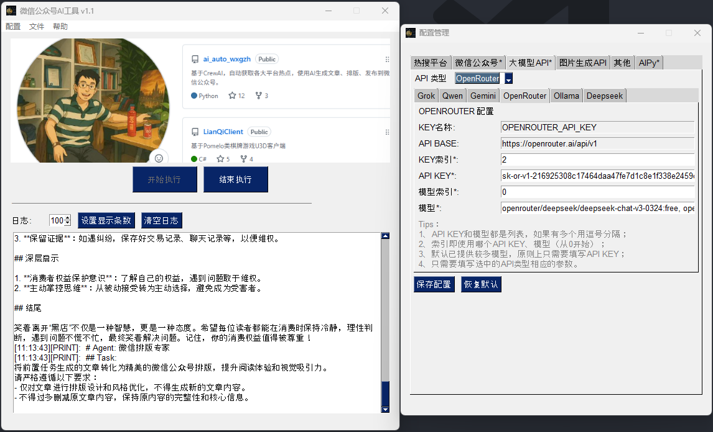

# CrewAI微信公众号全自动生成排版发布工具

      

基于 CrewAI 、AIPy 的微信公众号自动化工具软件，自动获取抖音、微博等平台热点，融合“搜索+借鉴+AI”，生成**高时效（实时）**、高质量、排版酷炫的文章并发布到微信公众号。👉[高大上文章排版预览](#模板发布效果预览)

**喜欢项目？点个 Star 支持一下吧！🌟**



## 🎯项目背景
为了学习CrewAI，特开发了这个小项目。最后才发现公众号（未认证）限制巨多，有认证微信公众号的可以更好的发挥这个项目的作用。

## 💎基本功能
- 自动获取各大平台热门话题
- 自动根据话题生成文章、排版（CrewAI多个角色共同完成）
- 自动发图文消息到公众号
- **生成实时性文章，拒绝文章数据过时（多重搜索策略）**
- **支持指定文章话题以及参考文章（借鉴+AI生成模式）**
- UI可视化，界面操作，方便配置编辑
- **支持开发模式和软件模式**
    - 开发模式：有定制开发需求，更灵活的改动（适用于技术自开发用户）
    - 软件模式：无需依赖开发环境，安装软件、填写配置即可（适用于非技术或者体验用户）

### 个性化功能
1. 为了更好的满足各种需求情况，通过配置文件`config.yaml`实现（通过界面/软件模式编辑更友好）：
- platforms：可以设定每个平台的随机选取的权重
- wechat: 支持配置多个微信公众号
- api：支持配置多个大模型平台，使用哪个修改`api_type`即可，只需改成你的api_key，其他不用变
    - model是列表，可以选用一个平台的多个模型中的一个，修改`model_index`即可
    - OpenRouter的api_key也设计了多个，可以用来切换多个号（每天有免费额度，用完切换账号即可，修改`key_index`）
- img_api：生成图片模型，主要是用来做公众号封面图的
    - picsum: 由于生成图片消耗太大，这里提供一种随机图片方式，修改成这个`api_type`即可
- use_template: 目前只有Claude 3.7有比较好的模板生成效果，由于无法直接使用（有API付费的可以，但消耗很高），这里特别设计是否使用内置模板（每天可以免费到Poe生成模板放到`knowledge/templates`文件夹下）
- template: 设为非""时，使用该模板（只需要文件名，如template1，如果不存在则随机，默认随机）
- need_auditor: 为了降低token消耗，提高发布成功率，可关闭“质量审核”agent/task（默认关闭）
- use_compress: 为了降低token消耗，可开关是否压缩模板（读取模板后压缩上传），可能会影响AI对HTML的解析
- use_search_service：作为一种搜索体验扩展（缓存本地优先使用），首次成功率较低（但后续采用本地成功缓存，搜索效率极高），默认False
- aipy_search_max_results: AIPy最大返回搜索结果条数
- aipy_search_min_results: AIPy最小返回搜索结果条数（越大参考内容越丰富，但搜索失败率越高）
- min_article_len：生成的文章最小字数（默认1000）
- max_article_len：生成的文章最大字数（默认2000）

2. AIPy配置`aipyapp.toml`，必填字段：
- default_llm_provider: 使用的模型，可以和CrewAI使用的不同，默认openrouter
- api_key: 模型提供商的key
- 其他选填

*通过配置管理界面，可以详细了解关键参数的解释说明（建议运行UI界面模式）*

## 🚀 快速开始
### 开发模式
1. 克隆仓库：
    - `git clone https://github.com/iniwap/ai_auto_wxgzh.git`
2. 安装依赖：
   - `pip install -r requirements.txt`
   - `pip install PySimpleGUI-4.60.5-py3-none-any.whl`
4. 配置 `config.yaml`、`aipyapp.toml`（*微信公众号AppID/AppSecret、CrewAI和AIPy使用的大模型提供商的API KEY*）
5. 运行：
    - 有UI界面：`python .\main.py -d` (**推荐**)
    - 无UI界面：`python -m src.ai_auto_wxgzh.crew_main`

### 软件模式
1. **请从网盘下载`微信公众号AI工具_Setup.exe`**👇，并安装
    - [移动云盘 提取码:1sgp](https://caiyun.139.com/w/i/2nQQRmAhg7Ffl)
    - [Microsoft OneDrive](https://1drv.ms/u/c/c831e3cc9be11110/Eaip7dg-hKBNqJRWQ_suJwgBh5naslCIumQy-2sC2D8KYQ?e=N4Oi5Z)
    - [Google Drive](https://drive.google.com/file/d/1NlY5jV8adIbpFv5_eWyk40kvzhku_eL0/view?usp=sharing)
2. 打开软件，进行必须要配置（*微信公众号AppID/AppSecret、CrewAI和AIPy使用的大模型提供商的API KEY*）
3. 点击`开始执行`

## 🔍问题定位
### 开发模式
1. 界面模式执行：**查看logs目录下的文件**，如`UI_2025-05-20.log`，提交issue
2. 无UI界面模式：**查看命令行输出**，复制提交issue
- 不同的CrewAI版本日志输出差别比较大，可临时更换下CrewAI版本：
```shell
pip  uninstall crewai
pip  install crewai==0.102.0
```
*此版本会输出过程日志，仍看不出问题的，可将日志提交Issue*  
- 恢复到最新版本：
```shell
pip  uninstall crewai
pip  install crewai
```
### 软件模式
请选择`文件->日志->UI_2025-05-20.log（选择当天的日志）`，点击打开、复制、提交Issue

### AIPy相关问题
1. 搜索分两种模式：缓存和非缓存模式，前者仅使用AIPy（缓存成功搜索代码，初次缓慢），后者同时使用本地搜索+AIPy（成功率更高）
2. 不是所有话题搜索引擎都能搜索到，如果失败属于正常现象，任务会继续执行的；
3. 搜索代码生成过程中可能会有错误，请忽略（有自动纠错机制，后续运行会修复），不影响整体运行；
4. 生成搜索代码有随机性，由于采用了缓存机制，多运行几次，搜索效果会提升；
5. 由于搜索引擎的限制以及人工验证的存在，会出现搜索不到结果的情况，请忽略，不影响整体运行。


⚠️**免费的OpenRouter有可能服务不正常，无法正确运行（这种情况只能等用的人少的时候再试）；一个账号首次执行成功率比较高，后续执行使用模板时候可能被截断。**
*这应该跟其最近修改了付费策略有关系，免费的终究是没那么好用。*

## 🔮模板发布效果预览
1. 经过反复的微调，已经完成发布到微信公众号的模板效果如下：
- **template1**: https://mp.weixin.qq.com/s/9MoMFXgY7ieEMW0kqBqfvQ
- **template2**: https://mp.weixin.qq.com/s/0vCNvgbHfilSS77wKzM6Dg
- **template3**: https://mp.weixin.qq.com/s/ygroULs7dx5Q54FkR8P0uA
- **template4**: https://mp.weixin.qq.com/s/-SexfJ1yUcgNDtWay3eLnA
- **template5**: https://mp.weixin.qq.com/s/pDPkktE_5KnkQkJ1x2-y9Q
- **template6**: https://mp.weixin.qq.com/s/7F_Qdho-hzxeVV6NrsPmhQ
- **template7**: https://mp.weixin.qq.com/s/ug7NseZDziDMWBVwe3s1pw
- **template8**: https://mp.weixin.qq.com/s/uDjKVrWop4XNrM-csQ-IKw
- **template9**: https://mp.weixin.qq.com/s/EVhL67x8w35IuNnoxI1IEA
- **template10**: https://mp.weixin.qq.com/s/pDN5rgCgz0CbA8Q92CugYw

2. 全自动发文（使用AIPy解决时效性）文章预览:
- **未使用模板**：https://mp.weixin.qq.com/s/KI4yHYrjAt8hd_nUEZP8kA
- **使用模板template9**：https://mp.weixin.qq.com/s/1XPMUPR09Ipuzm_yXgAvKw

*有兴趣的可以继续微调（如边距等），上面的模板可以比较好的显示在微信公众号上了。执行代码时，自动随机选择模板，生成的文章会自动选取填充上面的模板发布文章。*

 ## 📢后续计划
- 增加功能，使输出效果更好
- 优化模板，减少token消耗（持续）
- 优化处理，减少不必要的token消耗（持续）
- 增加容错，提升成功率（持续）

## 📌其他说明
### 关于微信公众号
~~由于不熟悉微信公众号开发，哪位知道如何正确的使用“position: absolute;”，麻烦提一个issue 或者PR给我。
这个很必要，因为生成的模板都使用了，浏览器显示正常，但是发布到微信公众号，就变成了垂直排列，无法作为背景。整体效果差太多了。~~

经过分析，发现以下问题：
- 发布文章后，微信会自动移除position: absolute（position: relative好像不会移除） ，必须通过其他方式实现
- 微信公众号支持animateMotion，不支持animate（经测试只支持透明度变化动画，也不全是模板1的动画没问题，这个需要继续测试）
- 调整好的模板，效果虽然不能完全和原来的相比，但是总体还不错（有背景装饰、有动画）
- 不支持button，会被自动移除
- 会自动移除 background: url
- `<linearGradient id="catGradient">`，此类动画，id会被自动移除，动画会失效
- 最近发现发布的文章不会显示到公众号文章列表，但是有时会收到消息通知（关注者），之前完全没通知（每天大概3-5篇的，后续不会有通知）
- **微信API访问IP白名单问题，这个有点恶心，只能使用的时候把当前IP添加进去；如果有代理直接开代理吧，使用那个固定IP即可（如果是固定的话）**
- **如果有云服务器，做个转发就行了；还可以使用阿里云函数计算代理微信API请求，免费的，但需要注册阿里云**
### 关于软件模式
- 为了支持软件模式，让大家更简单的体验项目，调试花费了很长时间(CrewAI使用大量资源，一个个试探出来的)，给个star支持下吧~
- 家庭网络IP可能不固定，通过API发微信公众号，需要将IP添加进微信公众号后台白名单（没有固定IP只能变化时添加，有代理的使用代理的固定IP即可）
- **不需要软件模式代码（运行于服务器的），删除UI以及main部分代码，直接无UI模式运行即可**
- 抓紧体验吧~更多功能开发中...
