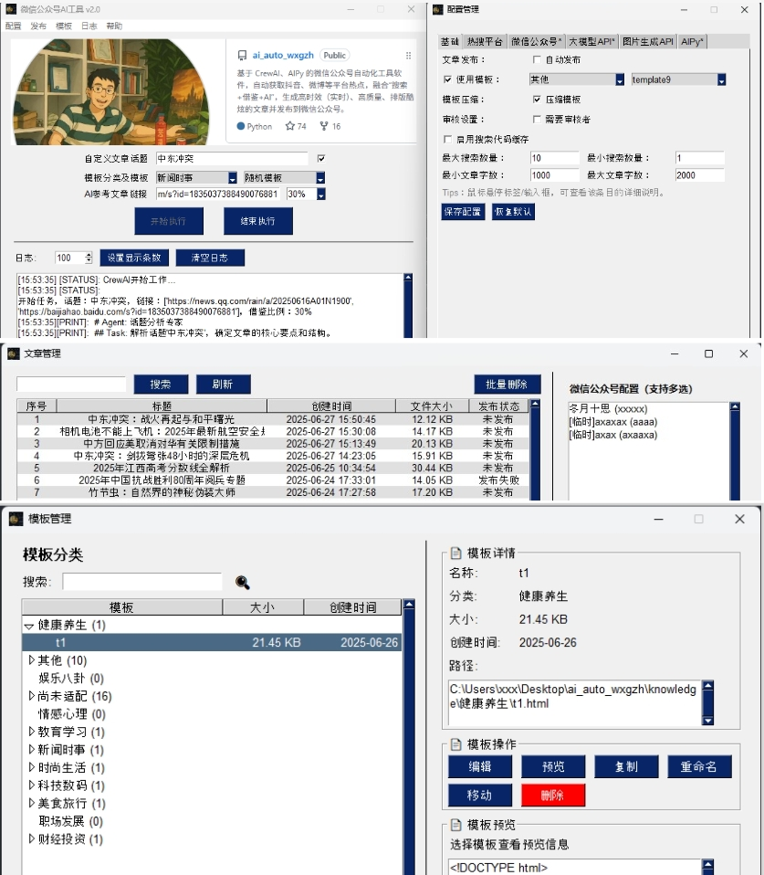

# CrewAI微信公众号全自动生成排版发布工具

      

基于 CrewAI 、AIPy 的微信公众号自动化工具软件，自动获取抖音、微博等平台热点，融合“搜索+借鉴+AI”，生成**高时效（实时）**、高质量、排版酷炫的文章并发布到微信公众号。👉[高大上文章排版预览](#微信公众号模板效果预览)

**喜欢项目？点个 Star 支持一下吧！⭐**



## 🎯 项目背景
为了学习CrewAI，特开发了这个小项目，最后才发现公众号（未认证）限制巨多，有认证微信公众号的可以更好的发挥这个项目的作用。随着研究、开发的深入，项目功能日趋完善，👉[赶紧体验吧~](#-快速开始)  
更多功能开发中，敬请关注项目 ：）

## 💎 基本功能
- **自动获取热门话题**：从各大平台实时抓取热门话题，确保文章标题/内容紧跟潮流
- **自动生成与排版**：利用 CrewAI 多角色协作，自动生成文章并完成酷炫排版
- **自动发布图文**：一键发布图文消息到微信公众号，简化运营流程
- **💡 实时文章生成**：采用多重搜索策略（本地+AIPy），拒绝过时内容，确保文章时效性
- **💡 指定话题及参考文章**：允许用户自定义文章话题、提供参考文章，结合 AI 生成高质量内容
- **UI 可视化管理**：提供软件界面，操作简单高效
- **💡 配置管理**：配置项编辑更加清晰，简单易用
- **💡 模板管理**：支持模板的各种操作，增删查改等
- **💡 文章发布管理**：支持文章管理的各种操作、批处理、发布记录以及公众号选择等
- **支持两种运行模式**：
  - **开发模式**：适合技术用户，支持灵活定制开发，适配复杂需求
  - **软件模式**：无需开发环境，安装软件并填写配置即可，适合非技术用户快速体验

### 个性化功能（配置）

通过 `config.yaml` 和 `aipyapp.toml` 配置文件，实现高度个性化的功能，推荐使用界面/软件模式编辑配置，操作更友好。以下是关键配置项说明：

- **`config.yaml` 配置项**

| 配置项                     | 说明                                                                         |
|----------------------------|-----------------------------------------------------------------------------|
| **platforms**              | 设置各平台热搜话题随机选取权重，控制选用优先级                                  |
| **wechat**                 | 支持配置多个微信公众号（ 自动发布时，**必填**`appid`、`appsecret`、`author`）   |
| **api**                    | 支持多种大模型平台，**必填**`api_key`                                         |
| **api.api_type**           | 支持多个大模型平台，修改 `api_type` 切换平台，如OpenRouter                     |
| **api.OpenRouter.model_index** | 修改 `model_index` 选择平台内具体模型                                     |
| **api.OpenRouter.model**      | 支持多种模型（如openrouter/deepseek/deepseek-chat-v3-0324:free）          |
| **api.OpenRouter.key_index** | 修改 `key_index` 切换账号（充分利用免费额度，付费账号无需多个）               |
| **api.OpenRouter.api_key** | 支持多个 OpenRouter `api_key`                                               |
| **img_api**                | 图片生成模型，用于公众号封面图                                                |
| **img_api.api_type**       | `ali`（需要填写`api_key`）或`picsum`（随机图片）                              |
| **img_api.picsum**         | 随机图片生成方式，降低生成图片消耗                                             |
| **use_template**           | 是否使用内置模板 ，不使用则AI根据要求直接生成文章HTML                           |
| **template**               | 指定模板文件名（如 `template1`），为空或不存在时随机选择                         |
| **template_category**      | 模板分类，精确匹配话题类型（如健康养生），需分类下存在指定模板                    |
| **need_auditor**           | 是否启用质量审核 agent/task，关闭可降低 token 消耗（默认关闭）                  |
| **use_compress**           | 是否压缩模板上传，降低 token 消耗                                             |
| **use_search_service**     | 启用本地缓存代码优先的搜索扩展，首次成功率较低，后续效率高                       |
| **aipy_search_max_results**| AIPy 最大返回搜索结果条数，控制搜索广度                                        |
| **aipy_search_min_results**| AIPy 最小返回搜索结果条数，越大内容越丰富，但失败率越高                         |
| **min_article_len**        | 生成文章最小字数（默认 1000）                                                 |
| **max_article_len**        | 生成文章最大字数（默认 2000）                                                 |
| **auto_publish**           | 控制自动发布，勾选（true）自动发布，不勾选(false)需手动发布                     |

- **`aipyapp.toml` 配置项**

| 配置项                     | 说明                                                                  |
|----------------------------|----------------------------------------------------------------------|
| **default_llm_provider**   | 使用模型提供商（默认 OpenRouter），可与 CrewAI 使用的模型不同。           |
| **api_key**                | 模型提供商的 API Key（必填）。                                          |
| **其他选填**               | 根据需要配置其他参数（选填），具体参考 UI 界面说明。                       |

> *1、通过配置管理界面，可以详细了解关键参数的解释说明（建议运行UI界面模式）*  
> *2、模板可通过 Poe免费的Claude 3.7 生成，放置到 `knowledge/` 对应分类文件夹*  
> *3、⚠️ 微信公众号AppID/AppSecret、CrewAI和AIPy使用的大模型提供商的API KEY是必填项，其他可默认*  

## 🚀 快速开始
### 开发模式
1. 克隆仓库：
    - `git clone https://github.com/iniwap/ai_auto_wxgzh.git`
2. 安装依赖：
   - `pip install -r requirements.txt`
   - `pip install PySimpleGUI-4.60.5-py3-none-any.whl`
4. 配置 `config.yaml`、`aipyapp.toml`（*微信公众号AppID/AppSecret、CrewAI和AIPy使用的大模型提供商的API KEY*）
5. 运行：
    - 有UI界面：`python .\main.py -d` (**推荐**)
    - 无UI界面：`python -m src.ai_auto_wxgzh.crew_main` （**不支持文章、模板管理**）

### 软件模式
1. 请从网盘下载`微信公众号AI工具_云盘版_Setup.exe` 👇，并安装
    - [移动云盘 提取码:ziug](https://caiyun.139.com/w/i/2nQQSzFEy8k9r)
    - [Microsoft OneDrive](https://1drv.ms/u/c/c831e3cc9be11110/EZm8ErtLJGlDhY2xkPdc_zcBJ6ya9SaYyEsufezcJlzJEg?e=TaT0Yh)
    - [Google Drive](https://drive.google.com/file/d/1L3LWwxnBmkXMnu1E80aqoLEomp-fZUlR/view?usp=sharing)
2. 打开软件，进行必须要配置（*微信公众号AppID/AppSecret、CrewAI和AIPy使用的大模型提供商的API KEY*）
3. 点击`开始执行`

## 🔍 问题定位

遇到问题时，请根据运行模式查看日志并提交 Issue。

### 开发模式
- **界面模式**：
  - 检查 `logs/` 目录下的日志文件，如 `UI_2025-05-20.log`。
  - 复制相关日志内容，提交至 [Issues](https://github.com/iniwap/ai_auto_wxgzh/issues)
- **无界面模式**：
  - 查看命令行输出日志，复制相关错误信息，提交至 [Issues](https://github.com/iniwap/ai_auto_wxgzh/issues)
- **CrewAI 版本问题**：
  - 不同 CrewAI 版本日志输出差异较大，建议临时切换到稳定版本查看详细过程日志：
    ```shell
    pip uninstall crewai
    pip install crewai==0.102.0
    ```
  - 如果问题仍未解决，提交日志至 [Issues](https://github.com/iniwap/ai_auto_wxgzh/issues)
  - 恢复最新版本：
    ```shell
    pip uninstall crewai
    pip install crewai
    ```

### 软件模式
- 打开软件界面，选择 `文件 -> 日志 -> UI_2025-05-20.log`（选择当天日志）。
- 点击打开日志文件，复制内容，提交至 [Issues](https://github.com/iniwap/ai_auto_wxgzh/issues)

### AIPy 相关问题
- **搜索模式**：
  - **缓存模式**：仅使用 AIPy，初次搜索较慢，后续执行依赖缓存代码，效率逐步提升。
  - **非缓存模式**：结合本地搜索与 AIPy，成功率更高，每次耗时相当。
- **正常现象**：
  - 并非所有话题都能搜索到结果，失败属正常，任务会继续执行。
  - 搜索代码生成可能出现错误，可忽略（系统有自动纠错机制，后续运行会修复）。
- **搜索缓存优化**：
  - 搜索代码生成具有随机性，启用缓存模式时，多运行几次可提升效果。
- **搜索引擎限制**：
  - 由于搜索引擎限制或人工验证，偶尔搜索无结果，属正常现象，不影响整体运行。
- **⚠️ OpenRouter 免费服务限制**：
  - **免费 OpenRouter 可能不稳定**，运行失败时建议等待用户较少时重试。
  - 每个账号每日约支持 5 次执行，失败后请切换账号（修改 `config.yaml` 中的 `api.OpenRouter.key_index`）。

> **⚠️ 注意**：免费 OpenRouter 服务可能因高负载导致不稳定，请合理安排运行时间或切换账号以确保成功运行。

## 🔮 微信公众号模板效果预览

以下是精心微调、适配并发布的微信公众号模板，涵盖多个话题分类，欢迎预览！

### 内置本地模板列表

- 分类模板

| 类别       | 模板名称 | 预览链接                       | 适用话题                      |
|------------|----------|------------------------------|--------------------------|
| 科技数码   | t1       | [点击预览](https://mp.weixin.qq.com/s/UCjBHaZ_EZVBdEaSEH-6mQ) | 科技前沿与数码评测       |
| 财经投资   | t1       | [点击预览](https://mp.weixin.qq.com/s/uTfYVXUG3_bjqSZ-uuJKeg) | 投资趋势与财经资讯       |
| 教育学习   | t1       | [点击预览](https://mp.weixin.qq.com/s/DOr7sSBQ2sYSqu4WmlH__g) | 学习方法与教育资讯       |
| 健康养生   | t1       | [点击预览](https://mp.weixin.qq.com/s/ZG6SFUYSZlrxyRw6_GH9yg) | 健康生活小贴士分享       |
| 美食旅行   | t1       | [点击预览](https://mp.weixin.qq.com/s/Lw29haJDk4uKODh7rlBOrw) | 美食推荐与旅行攻略       |
| 时尚生活   | t1       | [点击预览](https://mp.weixin.qq.com/s/ZgeIbl7l0KC1ex9ybrZBRg) | 时尚潮流与生活方式       |
| 职场发展   | t1       | [点击预览](https://mp.weixin.qq.com/s/-jJ-OxCr7BMaaYY68vSecQ) | 职场技能与职业规划       |
| 情感心理   | t1       | [点击预览](https://mp.weixin.qq.com/s/2j-C1tBWkpYIQhhR6tOwSg) | 情感故事与心理洞察       |
| 娱乐八卦   | t1       | [点击预览](https://mp.weixin.qq.com/s/3YeEH2Nvhsw8JqHIV0tftQ) | 最新娱乐圈动态速递       |
| 新闻时事   | t1       | [点击预览](https://mp.weixin.qq.com/s/M_l2LCJjiGmCWRvSm7lYvA) | 全球热点与时事分析       |

- 其他模板

| 类别       | 模板名称   | 预览链接                     | 适用话题                     |
|------------|------------|------------------------------|--------------------------|
|其他        | template1  | [点击预览](https://mp.weixin.qq.com/s/9MoMFXgY7ieEMW0kqBqfvQ) | 通用模板，无风格限定     |
|其他        | template2  | [点击预览](https://mp.weixin.qq.com/s/0vCNvgbHfilSS77wKzM6Dg) | 通用模板，无风格限定     |
|其他        | template3  | [点击预览](https://mp.weixin.qq.com/s/ygroULs7dx5Q54FkR8P0uA) | 通用模板，无风格限定     |
|其他        | template4  | [点击预览](https://mp.weixin.qq.com/s/-SexfJ1yUcgNDtWay3eLnA) | 通用模板，无风格限定     |
|其他        | template5  | [点击预览](https://mp.weixin.qq.com/s/pDPkktE_5KnkQkJ1x2-y9Q) | 通用模板，无风格限定     |
|其他        | template6  | [点击预览](https://mp.weixin.qq.com/s/7F_Qdho-hzxeVV6NrsPmhQ) | 通用模板，无风格限定     |
|其他        | template7  | [点击预览](https://mp.weixin.qq.com/s/ug7NseZDziDMWBVwe3s1pw) | 通用模板，无风格限定     |
|其他        | template8  | [点击预览](https://mp.weixin.qq.com/s/uDjKVrWop4XNrM-csQ-IKw) | 通用模板，无风格限定     |
|其他        | template9  | [点击预览](https://mp.weixin.qq.com/s/EVhL67x8w35IuNnoxI1IEA) | 通用模板，无风格限定     |
|其他        | template10 | [点击预览](https://mp.weixin.qq.com/s/pDN5rgCgz0CbA8Q92CugYw) | 通用模板，无风格限定     |

### 全自动发文效果预览

利用本地搜索与 AIPy 搜索生成时效性强的微信公众号文章效果预览：

| 类型           | 模板使用情况 | 预览链接                     | 说明                           |
|----------------|--------------|------------------------------|--------------------------------|
| 自动发文       | 未使用模板   | [点击预览](https://mp.weixin.qq.com/s/KI4yHYrjAt8hd_nUEZP8kA) | AI根据要求生成文章，未使用本地模板        |
| 自动发文       | 使用 template9 | [点击预览](https://mp.weixin.qq.com/s/1XPMUPR09Ipuzm_yXgAvKw) | 使用本地模板 template9，视觉效果优化   |
| 自动发文       | 使用 分类模板 | [点击预览](https://mp.weixin.qq.com/s/Dys7eszxP33k6tonXMO1VA) | 指定分类`健康养生`，完美呈现   |

### 浅色/暗色模式下微信显示的效果对比
| 类型           | 主题模式 | 预览链接                                                      | 说明                                       |
|----------------|--------------|---------------------------------------------------------|--------------------------------------------|
| 手动发文       | 浅色     | [点击预览](https://mp.weixin.qq.com/s/GOiOxGiym1dgqA77wrrFLw) |浏览器最佳模板，但在手机上边距显得过大         |
| 手动发文       | 浅色     | [点击预览](https://mp.weixin.qq.com/s/MFKPQIBdldyC_dxcpooOSw) |统一调整边距后的效果，手机上看着更紧凑些，但丢失原来设计效果   |
| 手动发文       | 暗色     | [点击预览](https://mp.weixin.qq.com/s/jOWDpRSAw9twSptzZbBODg) |原版为暗色，发到微信被强转（很难看），反而在浅色模式下正常显示   |


> *1、已适配模板可以比较好的显示在微信公众号上，有兴趣的可以继续微调内置模板（如边距等）*  
> *2、目前仅**尚未适配**下的模板未适配，需要适配才能完美显示（配置**分类随机**可能会随机到未适配模板）*  
> *3、目前模板无法很好的应对暗色模式，这和微信僵硬的处理有关，只能继续找思路，有点无解*  

 ## 📢 后续计划
- 增加功能，使输出效果更好
- 优化模板，减少token消耗（持续）
- 优化处理，减少不必要的token消耗（持续）
- 增加容错，提升成功率（持续）

## 📌 其他说明

### 关于微信公众号

以下是微信公众号开发及自动发文的注意事项与问题说明：

- **CSS 限制**：
  - 微信发布文章时会移除 `position: absolute`（但保留 `position: relative`），需使用替代布局实现类似效果
  - 动画支持有限：`animateMotion` 可用，但 `animate` 仅支持透明度变化，需进一步测试（例如，template1 动画部分支持）
  - `<button>` 和 `background: url` 会被自动移除
  - `<linearGradient id="catGradient">` 的 `id` 会被移除，导致动画失效
  - `background: linear-gradient(90deg, #4b6cb7 0%, #ff9a9e 100%); -webkit-background-clip: text; color: transparent;` 手机/电脑主题暗色模式不支持渐变，浅色模式支持
  - 微信暗色模式会自动添加`js_darkmode__`，会导致背景色失效，暗色模式效果均不佳（!important 强制不使用暗色模式无效，会自动移除）
- **暗色/浅色模式**：目前生成更倾向于适用微信浅色模式，暗色模式效果稍差，后续需要找到二者更好的平衡点
- **文章显示问题**：发布的文章（未认证公众号）不会显示在公众号文章列表，但关注者会收到通知（每日3篇）。
- **⚠️ 权限回收**：自 2025 年 7 月起，个人主体账号、未认证企业账号及不支持认证的账号将失去发布草稿权限，非认证公众号可能无法自动发文。
- **⚠️ 微信公众号 IP 白名单问题**：
  - 微信 API 需将当前 IP 添加至后台白名单。
  - 动态 IP 需手动更新白名单，或使用固定 IP 的代理。
  - 解决方案：使用云服务器转发请求，或通过阿里云函数计算（免费，需注册阿里云）代理微信 API 请求。

> **⚠️ 注意**：2025 年 7 月后，非认证账号将面临自动化发布限制。建议使用认证账号确保 API 正常访问。

### 关于软件模式

软件模式为非技术用户提供快速体验：

- **安装软件**：为支持软件模式，进行了大量调试。请点个 ⭐ 支持！
- **IP 白名单**：
  - 家庭网络动态 IP 需在微信后台手动更新白名单。
  - 使用固定 IP 的代理可提升稳定性。
- **无 UI 运行**：在服务器上运行无需 UI 时，可删除 `gui` 和 `main` 代码，直接以非 UI 模式运行。

> **⚠️ 注意**：运行软件模式前，需确保 IP 已添加至微信后台白名单，否则 API 访问将失败。

## 🤝 贡献
- 提交代码以及优化建议，新功能等等
- 分享自动发文功能的新场景或改进点

## 📩 联系我们
如需了解配置详情或扩展、定制功能，请联系我 QQ 522765228

## 📜 许可证 / License
本项目采用 Apache 2.0 许可证授权。用户在分发或修改本软件时，必须保留所有版权声明和许可证条款。  
详情请参阅 [LICENSE](LICENSE) 文件。
